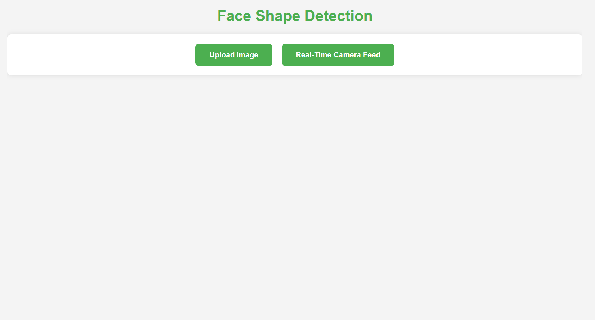
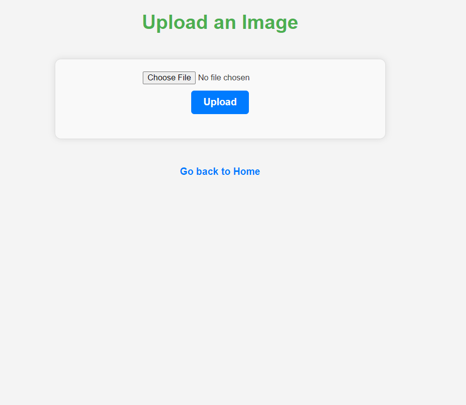
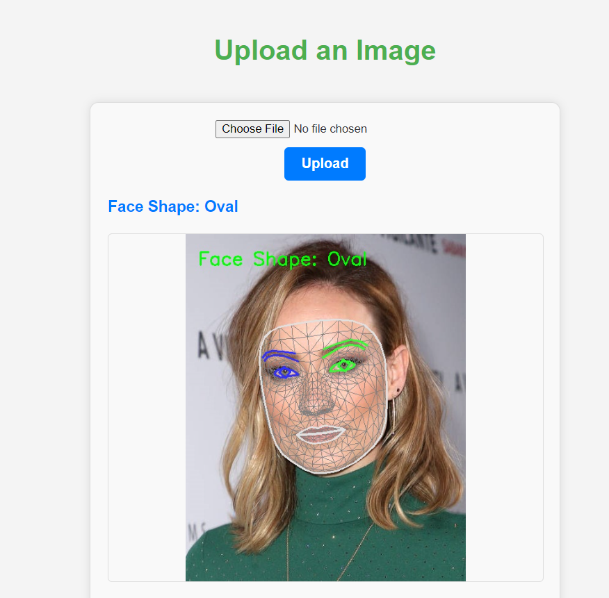
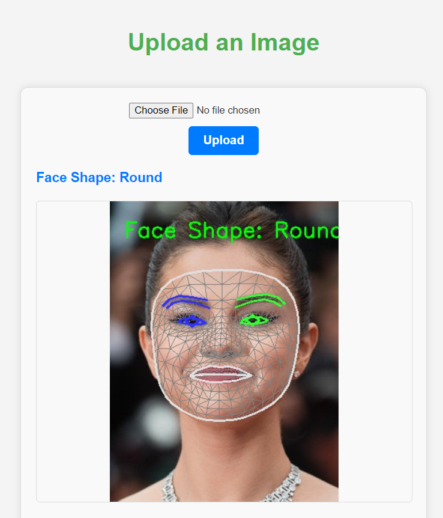
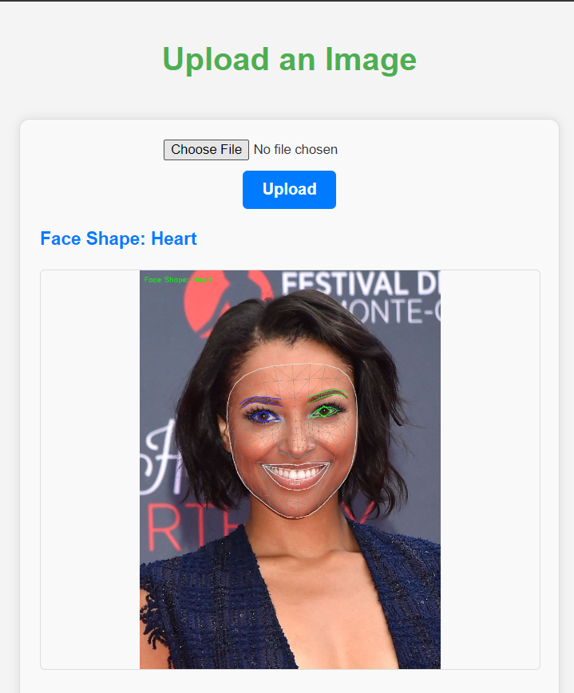

# Real-Time Face Detection and Face Shape.

## Installation Demo Link
https://youtu.be/hIFHVuGEes8?feature=shared

## Overview

This project involves a Flask-based web application for real-time face detection and face shape. It leverages MediaPipe for facial landmark detection and Random Forest for face shape classification. Users can upload images to get annotated results or view real-time face detection through their webcam.

## Features

- **Real-Time Face Detection**: Detect and annotate faces in real-time using your webcam.
- **Image Upload and Annotation**: Upload an image to get it processed and annotated with detected facial features.
- **Face Shape Classification**: Classify face shapes based on detected landmarks using a pre-trained model.

## Requirements

The following important libraries are used in this project:

- `Flask==3.0.3`
- `mediapipe==0.10.14`
- `opencv-contrib-python==4.10.0.84`
- `opencv-python==4.10.0.84`
- `scikit-learn==1.5.2`
- `random forest==2.1.1`

## Installation

1. **Clone the Repository**

   ```bash
   git clone https://github.com/akashchoudhary436/Face-Shape-Detection.git

2. **Go to the Face-Shape-Detection Directory**

   ```bash
   cd Face-Shape-Detection

3. **Install the Dependencies**

   ```bash
   pip install -r requirements.txt

4. **Run the Flask Application**

   ```bash
   python app.py

5. **Access the Web Application**

   Open a web browser and go to http://127.0.0.1:5000/ to access the home page.


## Data and Model Information

### Face Shape Classification Model

- **Model File:**: Best_RandomForest.pkl
- **Description:**: This model is trained using Random Forest on a dataset of facial landmarks. It classifies face shapes into categories 
such as Heart, Oval, Round, and Square.
- **Training Data**: The model was trained on a dataset of labeled face shapes with corresponding landmark features extracted using MediaPipe.

### Face Landmarker Model

- **Model File:**: face_landmarker_v2_with_blendshapes.task
- **Description:**: This MediaPipe model detects facial landmarks and provides blendshapes for facial expressions.
- **Training Data**: Used to detect key facial landmarks required for both face shape classification and real-time annotations.


# Steps to Train the Face Shape Classification Model

Here's a step-by-step guide to training the dataset and creating a face shape classification model based on the provided code:

## 1. Prepare Your Data

Ensure your dataset is organized in a directory structure where each subdirectory corresponds to a face shape category. For example:
 
 ```bash
Face_Shape/
    heart/
        image1.jpg
        image2.jpg
        ...
    oval/
        image1.jpg
        image2.jpg
        ...
    round/
        image1.jpg
        image2.jpg
        ...
    square/
        image1.jpg
        image2.jpg
        ...
 ```

## 2. Run the Data Processing and Model Training Script

### Using the Jupyter Notebook

There is already a Best_Train-Model_RandomForest file that contains the code for processing the dataset, extracting features, training the Random Forest model, and saving the trained model. Here’s how you can use it:

1. **Open the File**

   Open the Best_Train-Model_RandomForest file.

2. **Run the Notebook:**

Execute all cells in the notebook. This will perform the following tasks:

- Load Images and Extract Features: The notebook reads images from the specified dataset directory, detects facial landmarks using MediaPipe, and extracts relevant features.
- Train the Model: The notebook trains an Random Forest model using the training data.
- Save the Model: Finally, the trained model is saved to a file named Best_RandomForest.pkl.

## 2. Using the Model

Once you have the trained model file (Best_RandomForest.pkl), you can use it in your Flask application to classify face shapes from detected landmarks in real-time or uploaded images.

## Screenshots


### Landing Page


### Upload Page


### Oval Shape Image


### Round Shape Image


### Heart Shape Image

